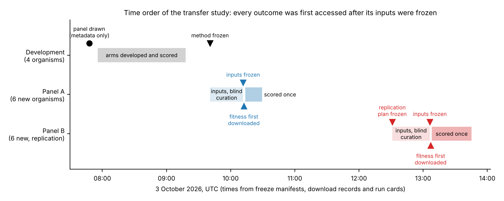
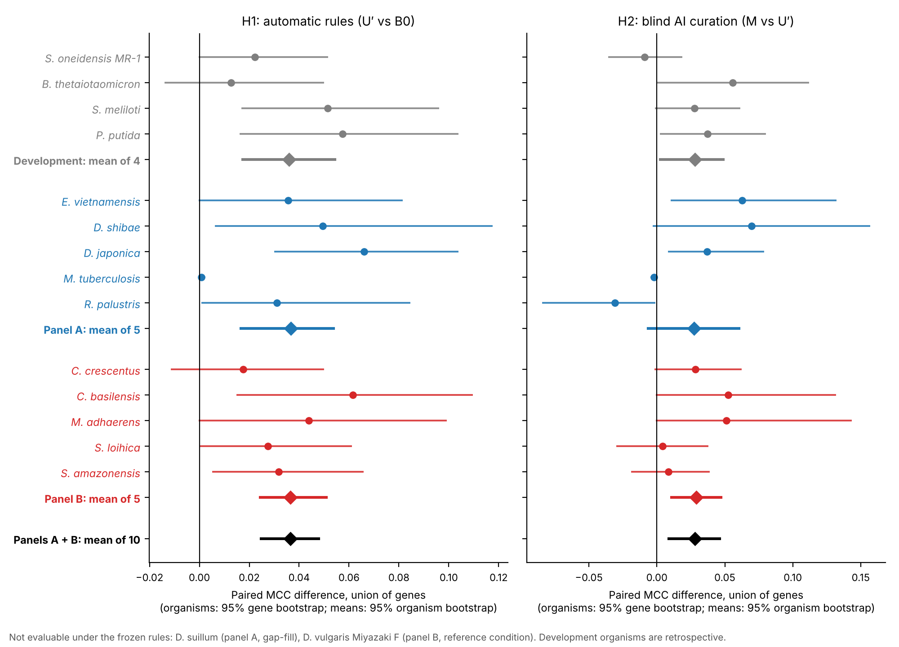
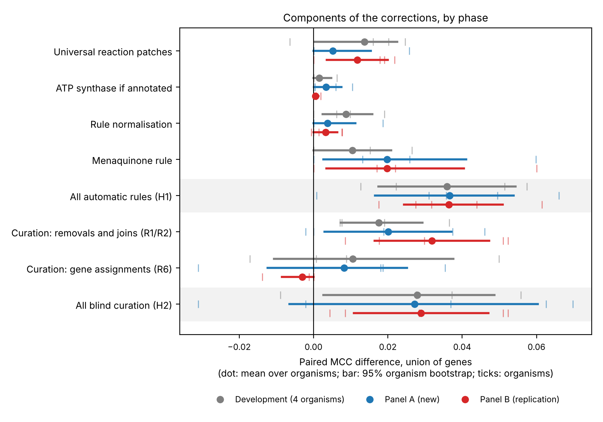
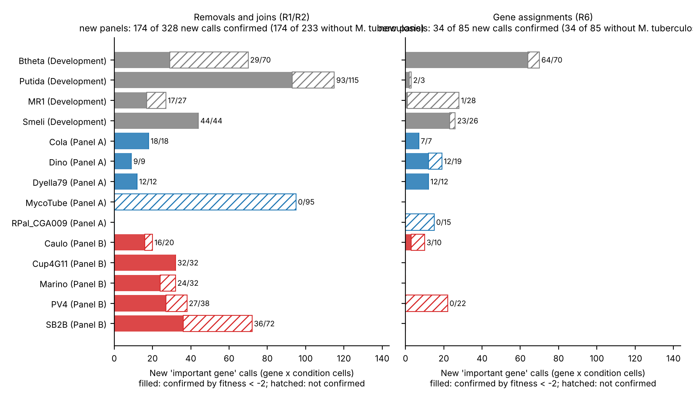

# Paper 1 draft: do corrections to draft metabolic models transfer?

> Repository copy of the Claude Docs draft (https://claude.ai/code/artifact/58c661c0-bff9-419c-a2e4-bbf1a6e4b3c3), exported 5 October 2026. The doc is the working version; this copy records the text at export.

Oct 5, 2026 · @Tim Hulshof

## Note for Tim

This is a first full draft of the benchmark paper, written only from the frozen transfer study and its replication. No number in it is new: each comes from a result file in the repository (branch `claude/opus-continuation`), listed under Data and code availability; numbers derived for the paper are in `results/transfer_v1/paper1_derived_numbers.json`.

Decisions that are yours:

- [ ] Target journal. The structure is journal-neutral (Introduction, Results, Discussion, Methods); candidates include Molecular Systems Biology, PLOS Computational Biology and Genome Biology.
- [ ] Authors, and the statement of how AI was used (the curation itself and most of the analysis were done by Claude).
- [ ] Whether to add a robustness check with current CarveMe drafts of the same twelve organisms (robustness only: these organisms are now exposed).
- [ ] Whether to contact Bernstein et al. to reconcile their reference numbers before citing them (roadmap Q7).
- [ ] Licence check for redistributing Fitness Browser data, EMBL GEMs drafts and the CarveMe universe.
- [ ] Confirm that the curation packets' gene descriptions are the original annotations, not the Fitness Browser's fitness-based re-annotations (this bears on the blinding of the AI curator).
- [ ] For future studies, a public registration (for example on OSF) instead of a private project record.

## Title and abstract

Working titles:

1. Do corrections to draft metabolic models transfer to new organisms? A pre-specified, replicated test on twelve bacteria
2. Fitness-blind curation of automatically reconstructed metabolic models, tested on held-out bacteria against genome-wide mutant fitness

**Abstract.** Automatically reconstructed genome-scale metabolic models are the only models available for most bacteria. Improvements to them are usually judged on the same data that guided them. We asked whether corrections developed on four bacteria improve predictions for organisms that played no part in their development.

We scored historical CarveMe drafts (EMBL GEMs) against genome-wide mutant fitness (RB-TnSeq) on carbon sources. On four development bacteria, with the curated *E. coli* model as a reference, we derived five automatic correction rules that use only the genome annotation. We also wrote a procedure in which an AI model curates gene–reaction rules from annotation alone. We froze both in time-stamped manifests. Only then did we download fitness data for a first panel of new organisms and score every model once. We then repeated the test unchanged on a second panel.

The automatic rules raised the Matthews correlation coefficient (MCC) by +0.036 in development and by +0.037 and +0.036 on the two new panels. Pooled over the ten evaluable new organisms the gain was +0.037 (95% interval 0.025 to 0.048): nine organisms improved, one was unchanged and none got worse. Blind AI curation added +0.028 (0.009 to 0.046; eight up, two down). The gain came from removing gene alternatives that are not catalysts (+0.026; the curator joined subunits only twice). Assigning genes to gene-less reactions gave no net gain (+0.003). Rules fixed in advance left two of the twelve organisms unevaluable and misrepresented two more.

Simple annotation-based corrections transferred to ten held-out bacteria, within one assay platform and one 2017 draft collection. A self-custodied, time-stamped protocol is a cheap way to test whether a model change helps. Code, freeze manifests and every curation decision are in the project repository.

## Introduction

Corrections to automatically built metabolic models are rarely tested on organisms they were not developed on. This study runs that test.

Genome-scale metabolic models link genes to reactions and predict which genes an organism needs to grow in a given environment. Automated pipelines such as CarveMe \[1\], gapseq \[2\] and ModelSEED \[3\] now build most available models. The EMBL GEMs collection alone holds 5,587 CarveMe drafts \[1\]. Drafts from different tools disagree with each other \[4,5\] and with measured phenotypes \[2\], and curation is what turns a draft into a useful model \[6,7\].

How do we know that a correction helps? Usually by scoring it against phenotype data, often the same data that suggested it. A correction chosen because it fixes a disagreement will look good on the data that revealed that disagreement, whether or not it generalizes. Structural quality scores do not settle the question either, because they measure a model's structure rather than its predictions \[8\].

Randomly barcoded transposon sequencing (RB-TnSeq) measures the fitness of mutants in nearly every gene, for dozens of bacteria across many carbon sources \[9,10\]. Bernstein et al. showed how to use such data to evaluate *Escherichia coli* models \[11\]. Because the data cover many organisms, they allow a stronger test: develop corrections on some organisms, then score them on organisms that played no part.

AI models are entering curation as well. For Human2 (Human-GEM 2.0), GPT-4 assessed all 26,246 gene–reaction pairs; the pairs it flagged were reviewed by hand, and the updated model was evaluated against CRISPR gene essentiality \[12\]. Machine-learning gap-filling has also been shown to improve phenotype predictions of draft models \[15\]. To our knowledge, no fully automated correction procedure has been frozen before any outcome was accessed, tested on several held-out organisms with an isolated, paired effect estimate, and then replicated.

Here we developed five annotation-based correction rules and a written AI curation procedure on four bacteria, and froze both. We then scored them once on six new bacteria whose fitness data were downloaded only after the freeze, and repeated the test unchanged on six more. We report what transferred, what did not, and where the fixed pipeline itself limited the test.

## Results

### A panel declared before any outcome, and a recorded time order

Every outcome of a new organism was first accessed after the method and that organism's inputs were frozen (Figure 1).

**Panel.** Eligibility was declared before anything was downloaded:

- Fitness Browser bacteria not used before in this project;
- an exact-strain draft in the EMBL GEMs collection;
- at least eight carbon-source experiments;
- at most three base media.

Twelve organisms qualified. A seeded random split assigned six to panel A and six to a reserved panel B. Until each panel's inputs were frozen, only non-outcome data were downloaded: gene and experiment metadata, protein sequences and the draft models.

**Arms.** Three models were built per organism:

- **B0:** the draft with a minimal gap-fill for growth on one reference condition, chosen by a written rule;
- **U′:** B0 plus five automatic, annotation-based rules;
- **M:** U′ plus gene-rule decisions made blind by an AI curator.

**Primary metric.** The paired difference in MCC between two arms, on the union of their scored genes. Per organism it carries a gene-bootstrap 95% interval. Across organisms it is the mean of the per-organism differences, with an organism-bootstrap 95% interval. The pre-declared reading: **supported** if the mean is positive and its interval excludes zero, **not supported** if the mean is zero or negative, and **inconclusive** otherwise.

**Time order.** Each freeze is a manifest of file hashes, committed to git. Each was also recorded in a private project document, whose server timestamps follow the freezes by less than half a minute (09:41:01, 10:11:50, 12:31:17 and 13:06:45). All times are on 3 October 2026 (UTC):

1. method frozen at 09:40:45;
2. panel A inputs (media, carbon sources, base models, curation decisions) frozen at 10:11:43;
3. panel A fitness tables first downloaded between 10:12:18 and 10:12:40, then every arm run once;
4. replication plan frozen at 12:31:09;
5. panel B inputs frozen at 13:06:21;
6. panel B fitness tables first downloaded between 13:07:00 and 13:07:20, then every arm run once.

On 3 October a separate agent, using its own code, recomputed the primary and secondary results from the run matrices, with exact agreement. It checked the fitness values of every arm against the downloaded tables (376,620 arm × gene × condition cells on panel A and 881,911 on panel B). It also confirmed the time order from git history, the manifests, the download records and the external timestamps. A second agent checked this paper's derived tables, figures and counts against the result files on 5 October.

*Figure 1. Time order of the transfer study on 3 October 2026 (UTC). The panel was drawn from metadata only. The organism-specific corrections behind the development arms were made in September. Their annotation-triggered form, and the arms shown here, were written and run on 3 October, after the panel was drawn and before any panel outcome was downloaded. Times come from the freeze manifests, the download records and the run cards.*

### The drafts agree only moderately with mutant fitness

Before any correction, the drafts predict gene importance with MCC 0.33–0.52 in eight of the ten evaluable new organisms (Table 1).

- **The outliers.** *R. palustris* (0.145) and *M. tuberculosis* (−0.016) are well below that range; their models misrepresent the experiments.
- **Gap-fill.** Most drafts needed a small gap-fill to grow on their reference condition: 0 to 7 reactions.
- **Coverage.** Most models grew in only part of the mapped conditions, in as few as 7 of 21 (*D. shibae*) or 3 of 7 (*R. palustris*). *M. tuberculosis* grew in all 19.
- **Corrections and coverage.** The corrections changed the number of conditions with growth by at most one, and only in three new organisms.

*Table 1. Organisms of the transfer study. Conditions mapped: compound × medium conditions whose carbon source maps to a BiGG metabolite; some lack an exchange reaction in the model and cannot support growth. Grows: conditions in which the model grows, for B0 and U′. MCC: union-gene MCC of B0 and U′ on the H1 comparison and of M on the H2 comparison, each on its own paired observations.*

| Phase | Organism | Gap-fill reactions | Conditions mapped | Grows B0 / U′ | Union genes | MCC B0 / U′ / M | Status |
| --- | --- | --- | --- | --- | --- | --- | --- |
| Development | *Bacteroides thetaiotaomicron* VPI-5482 | 5 | 25 | 14 / 14 | 507 | 0.497 / 0.510 / 0.551 | evaluable |
| Development | *Pseudomonas putida* KT2440 | 2 | 43 | 28 / 28 | 1,038 | 0.496 / 0.553 / 0.590 | evaluable |
| Development | *Shewanella oneidensis* MR-1 | 3 | 12 | 8 / 9 | 713 | 0.470 / 0.492 / 0.479 | evaluable |
| Development | *Sinorhizobium meliloti* 1021 | 1 | 33 | 21 / 22 | 979 | 0.565 / 0.617 / 0.639 | evaluable |
| Panel A | *Echinicola vietnamensis* DSM 17526 | 0 | 14 | 7 / 7 | 497 | 0.440 / 0.476 / 0.533 | evaluable |
| Panel A | *Dinoroseobacter shibae* DFL 12 | 7 | 21 | 7 / 7 | 584 | 0.422 / 0.472 / 0.530 | evaluable |
| Panel A | *Dyella japonica* UNC79MFTsu3.2 | 3 | 9 | 6 / 6 | 542 | 0.502 / 0.568 / 0.597 | evaluable |
| Panel A | *Mycobacterium tuberculosis* H37Rv | 0 | 19 | 19 / 19 | 463 | −0.016 / −0.016 / −0.018 | evaluable |
| Panel A | *Rhodopseudomonas palustris* CGA009 | 5 | 7 | 3 / 3 | 679 | 0.145 / 0.176 / 0.145 | evaluable |
| Panel A | *Dechlorosoma suillum* PS | — | — | — | — | — | not evaluable: gap-fill failed |
| Panel B | *Caulobacter crescentus* NA1000 | 4 | 13 | 5 / 5 | 547 | 0.431 / 0.448 / 0.475 | evaluable |
| Panel B | *Cupriavidus basilensis* 4G11 | 1 | 36 | 15 / 16 | 958 | 0.373 / 0.435 / 0.486 | evaluable |
| Panel B | *Marinobacter adhaerens* HP15 | 4 | 29 | 16 / 16 | 615 | 0.329 / 0.373 / 0.424 | evaluable |
| Panel B | *Shewanella loihica* PV-4 | 3 | 12 | 9 / 10 | 645 | 0.483 / 0.511 / 0.515 | evaluable |
| Panel B | *Shewanella amazonensis* SB2B | 1 | 20 | 14 / 15 | 648 | 0.518 / 0.549 / 0.560 | evaluable |
| Panel B | *Desulfovibrio vulgaris* Miyazaki F | — | — | — | — | — | not evaluable: no reference condition |

### The automatic rules transfer, and the transfer replicates

The five automatic rules improved agreement on new organisms by the same amount as in development: +0.036 in development, +0.037 on panel A and +0.036 on panel B (Figure 2, left).

| Set | Mean MCC difference, U′ − B0 \[organism bootstrap 95%\] | Up / down / unchanged | Sign test p | Reading |
| --- | --- | --- | --- | --- |
| Development, 4 organisms (retrospective) | +0.036 \[0.017, 0.054\] | 4 / 0 / 0 | — | — |
| Panel A, 5 evaluable | +0.037 \[0.017, 0.054\] | 4 / 0 / 1 | 0.125 | supported |
| Panel B, 5 evaluable | +0.036 \[0.024, 0.051\] | 5 / 0 / 0 | 0.063 | supported: replicated |
| Panels A and B, 10 evaluable | +0.037 \[0.025, 0.048\] | 9 / 0 / 1 | 0.004 | supported |

- **No organism got worse.** The one unchanged organism is *M. tuberculosis*, whose model carries no signal in any arm (Results, last section).
- **Same on common genes.** Restricted to genes present in both models, the pooled estimate is identical (+0.037 \[0.025, 0.048\]).
- **Same with t-intervals.** With five organisms per panel the percentile bootstrap is coarse. t-based 95% intervals give the same readings: panel A \[0.007, 0.067\], panel B \[0.015, 0.057\], pooled \[0.022, 0.051\].
- **What changed.** Across the ten new organisms the gain rests on 53 genes whose predictions changed (2 to 10 per organism). Of 274 gene × condition calls that switched from important to unimportant, 273 agree with the data; of 117 that switched the other way, 94 do.

**Which rules carried it (Figure 3).**

- **Menaquinone rule.** This rule removes menaquinone from the biomass when the annotation shows fewer than two of the eight steps of its pathway. It contributed the most on both new panels: +0.020 each (panel A \[0.003, 0.041\]; panel B \[0.003, 0.040\]), against +0.010 in development. It fired in six of the ten new organisms and never lowered MCC. All 200 calls it changed went from important to unimportant, and 199 agree with the data. They involve 24 genes, mostly not menaquinone enzymes: thioesterases, β-oxidation and 2-methylcitrate-cycle enzymes and 4-hydroxybenzoyl-CoA reductase subunits, which the drafts had drawn into a route to menaquinone.
- **Universal reaction patches.** +0.005 on panel A and +0.012 on panel B, against +0.014 in development.
- **Smaller contributions.** Rule normalisation added +0.004 and +0.003, and the ATP synthase rule +0.003 and +0.001.

**Stable total, shifting parts.** The total gain was the same in all three phases, but its make-up shifted: the reaction patches and rule normalisation contributed less on the new panels than in development, and the menaquinone rule more. The gain is consistent but modest. After correction, MCC stays between 0.37 and 0.57 in the eight organisms with a working model.

*Figure 2. Paired MCC differences per organism, union of genes. Left: automatic rules (U′ vs B0, H1). Right: blind AI curation (M vs U′, H2); the two panels have different x-axis ranges. Circles: organisms, with 95% gene-bootstrap intervals. Diamonds: means over organisms, with 95% organism-bootstrap intervals. Grey: development organisms (retrospective). Blue: panel A. Red: panel B. Black: pooled new organisms. D. suillum and D. vulgaris Miyazaki F were not evaluable under the frozen rules.*

*Figure 3. Contribution of each component, by phase. Each row compares an arm with the arm it extends, on the union of genes. Dots: mean over organisms. Bars: 95% organism-bootstrap interval. Ticks: individual organisms.*

### Blind AI curation helps, through one kind of decision

Blind AI curation of gene rules added +0.028 MCC pooled over the ten new organisms (Figure 2, right). Almost all of the gain came from removing gene alternatives that are not catalysts.

**How the curator worked.** It never saw fitness data. For each organism, a fresh AI subagent received a packet built from the U′ model and gene annotations only. The packet listed the gene-less reactions and the alternative-gene (OR) rules of reactions essential in at least one condition. Every gene came with its Fitness Browser description, RefSeq definition and genomic neighbourhood. The subagent was the same Claude model as the study session and made one attempt, under a fixed written procedure. It was instructed to open only its packet and not to use the web; its tools were not technically restricted. Four outcomes were allowed:

- **removal** (R1): remove an alternative that is not a catalyst;
- **join** (R2): join subunits into a complex;
- **assignment** (R6): assign genes to a gene-less reaction;
- abstain.

| Set | Candidates | R1 | R2 | R6 | Abstained |
| --- | --- | --- | --- | --- | --- |
| Development (4 organisms) | 296 | 62 | 2 (with R1) | 18 | 214 |
| Panel A (5 organisms) | 265 | 76 | 2 | 25 | 162 |
| Panel B (5 organisms) | 297 | 74 | 0 | 12 | 211 |

**Results by panel.**

- **Panel A: inconclusive.** +0.027 \[−0.007, 0.060\], three organisms up and two down. The two losses were *M. tuberculosis* (−0.002) and *R. palustris* (−0.031), the two organisms whose models misrepresent the experiments. Without *M. tuberculosis* (a pre-declared sensitivity analysis, because its phenotypes are widely published), the estimate was +0.035 \[−0.008, 0.066\].
- **Panel B: supported.** +0.029 \[0.011, 0.047\], five of five up. This is the clean replication: the pooled analysis below was declared after the panel A results were known.
- **Pooled: supported.** +0.028 \[0.009, 0.046\], eight up and two down (sign test p = 0.11). On common genes: +0.026 \[0.013, 0.040\].
- **t-intervals.** Panel A \[−0.026, 0.081\], panel B \[0.001, 0.057\], pooled \[0.005, 0.051\]: the same readings, with panel B and the pooled estimate close to zero at their lower end.

**Which decisions helped.**

- **Removals** carried the gain: removals and joins together gave pooled +0.026 \[0.014, 0.038\], eight up, one down, one unchanged. On the new panels the curator joined subunits only twice, both in *M. tuberculosis*, so the effect of joins is untested.
- **Assignments** gave nothing on balance: pooled +0.003 \[−0.008, 0.013\], three up, three down, four unchanged.

**Precision of the new calls.** Curation only adds "important gene" calls: it never turned an important call into an unimportant one. So the question is how many of the new calls the fitness data confirm (Figure 4). The counts are gene × condition calls, so one gene can count many times: the 328 calls from removals and joins involve 29 genes.

- **R1/R2.** On the new panels, these decisions created 328 new calls (gene × condition) and the data confirm 174. Of the 154 misses, 95 are in *M. tuberculosis*, whose model has no signal. Without it, 174 of 233 are confirmed (75%).
- **R6.** Assignments created 85 new calls, of which 34 are confirmed; on panel B only 3 of 32.
- **For comparison.** Between 0.6% and 16% of gene × condition cells are important in the data. U′'s own important calls are 44–80% precise in the organisms whose models carry signal.

**Ion transporters.** Two thirds of the unconfirmed assignment calls (34 of 51) involve ion transporters: a zinc ABC transporter in *R. palustris*, chloride channels in *C. crescentus* and *S. loihica*, and a manganese transporter in *S. loihica*. These genes became important in every condition with growth, and none is. The other 17 involve dihydropyrimidinase, the glycine-cleavage T and H proteins, dihydroorotate dehydrogenase and a lactate permease. A secondary hypothesis added before panel B (H3) dropped assignments to inorganic-ion transport reactions. It pointed the right way (+0.003 \[0.000, 0.008\]) but was inconclusive, because the filter changed only two organisms.

*Figure 4. New "important gene" calls made by blind curation, by decision kind and organism. Filled: confirmed by the fitness data (fitness ≤ −2). Hatched: not confirmed. Counts are gene × condition cells on the union of genes.*

### The fixed pipeline set its own limits

Rules fixed in advance left two organisms unevaluable and misrepresented two more. None was replaced or dropped after the outcomes were seen.

| Organism | What happened | Rule responsible |
| --- | --- | --- |
| *D. suillum* PS (panel A) | All six gap-fill solutions found within the six-round limit created an energy-generating cycle, so no base model could be built. Its fitness table was never downloaded. | gap-fill with an energy-cycle gate |
| *D. vulgaris* Miyazaki F (panel B) | The carbon-source experiments of its main medium name no compound, so no reference condition could be chosen. Its fitness table was never downloaded. | reference-condition rule |
| *M. tuberculosis* H37Rv (panel A) | The "no carbon" Sauton's medium still contains asparagine, citrate (as ferric ammonium citrate) and 0.2% ethanol. As defined organics these are unlimited, so the model grows at implausible rates (5–9 per hour) in every condition and its predictions carry no signal (MCC about 0 in every arm). | media rule |
| *R. palustris* CGA009 (panel A) | The experiments are phototrophic and anaerobic, but the CarveMe universe has no photosystem. The gap-fill made the model respire the trace nitrate of the medium's cobalt nitrate, so it grows in 3 of 7 conditions with the wrong energy metabolism (MCC 0.14–0.18). | media rule; no light input |

Each problem suggests a fix:

- limit counter-ions that come only from trace-element salts;
- flag organic carbon in "no carbon" media;
- handle phototrophs;
- add more gap-fill cut rounds;
- use a reference rule that skips media without named carbon sources.

Testing such fixes needs new organisms, because every eligible organism has now been used.

## Discussion

Corrections derived from four bacteria improved predictions for nine of ten held-out bacteria and left the tenth unchanged. This holds within one assay platform and one 2017 draft collection. The three estimates agree within 0.001: +0.036, +0.037 and +0.036.

**The gain is small but reliable.** No new organism got worse under the automatic rules, and the total effect was the same in development, on the first panel and on the replication panel. A set of rules tuned to the quirks of its development organisms would shrink on new ones; this set did not. The agreement is in the total, though, not rule by rule: the parts shifted between phases (Figure 3). In practical terms the gain is 53 genes with changed predictions across ten organisms, almost all of them changed correctly. The corrected drafts are still far from good: an MCC of 0.4–0.6 leaves most of the gap between draft and experiment open.

**What transferred is unglamorous.** On the new organisms the largest single contribution came from a biomass rule: dropping menaquinone where the annotation shows fewer than two of the eight steps of its pathway. The calls it corrected were mostly not about menaquinone enzymes. They concerned enzymes that the drafts had drawn into a route to menaquinone to satisfy the biomass demand. A universal biomass that demands what an organism cannot make distorts which genes look essential. The rule's annotation trigger has not yet been checked against measured quinone types, which differ systematically between bacterial groups \[16\].

**AI curation works within limits.** Without seeing outcomes, an AI curator improved predictions on eight of ten new organisms; the clean replication on panel B gave +0.029. The gain came from one kind of decision: removing gene alternatives that are not catalysts. Assigning genes to gene-less reactions did not help on balance, and two thirds of its wrong calls involved ion transporters. That suggests a practical policy: let AI curators remove alternatives, and hold their gene assignments, especially to ion transporters, to a stricter standard. Joins of subunits were too rare here to judge.

**Pre-specification is cheap.** It took hours, not months, to do four things: freeze a method, record the freeze, download outcomes only afterwards and have an independent agent recompute every number. The same design suits other claims that a model change helps. Here it has three weaknesses:

- **Self-custody.** The same model family designed, prepared and scored the test, and checked it.
- **A private record.** The external time record is a private project document. A public registration would be stronger.
- **One manifest changed.** The replication plan's manifest no longer verifies at the current head, because one input file gained panel B entries before the panel B inputs were frozen.

An external custodian of the outcome data, or a community challenge on newly measured organisms, would remove the first weakness.

**Limits.**

- **One assay platform and one draft collection.** RB-TnSeq fitness and the 2017 EMBL GEMs drafts; current CarveMe output and other reconstruction tools are untested.
- **Fitness is not growth.** Pooled competitive fitness is not single-mutant growth. Only genes with fitness values are scored, which excludes genes essential in the library's growth medium, so the benchmark measures carbon-source-specific importance. The threshold of −2 was used without a t-score filter.
- **The metric.** MCC on binary calls was pre-specified. Bernstein et al. recommend the area under the precision–recall curve \[11\], which we have not analysed on matched observations.
- **Small panels.** Ten evaluable organisms, two of them *Shewanella* species related to the development organism *S. oneidensis*.
- **Development exposure.** The curated *E. coli* model helped flag one reaction patch, so *E. coli* counts as a fifth exposed organism.
- **Blinding of the curator.** It rests on instructions. The packets' gene descriptions came from the Fitness Browser gene table. Whether any of them reflect the Browser's fitness-based re-annotations remains to be checked.
- **Unknown training exposure.** The AI curator's training may include published phenotypes; the pre-declared sensitivity analysis without *M. tuberculosis* did not change the reading.
- **Fixed pipeline choices.** These excluded or misrepresented four of twelve organisms.

**Next tests.**

- Current CarveMe drafts of the same organisms (a robustness check, since these organisms are now exposed).
- A random-removal control for the curator's removals.
- Other phenotype types, such as growth profiles.
- Organisms whose fitness data are published after a method is frozen.

## Methods

**Data.**

- **Fitness.** Fitness Browser RB-TnSeq gene fitness and experiment metadata \[9,10\]. Carbon-source experiments with no second condition other than DMSO were grouped by compound and base medium, and fitness was averaged over replicate experiments.
- **Models.** EMBL GEMs drafts \[1\] pinned at collection commit 260d0f1, and the CarveMe bacterial universe.
- **Media recipes.** FEBA medium recipes (bitbucket commit 803273865ea9).

**Panel selection.** Eligibility criteria were declared before any candidate's data were downloaded:

- in the Fitness Browser on the selection date;
- not among the nine organisms with archived downloads in the project;
- a bacterium;
- an exact-strain EMBL GEMs model, after normalising punctuation and known taxonomic renamings;
- at least eight carbon-source experiments;
- at most three base media.

Eligible organisms were ordered by identifier and shuffled with a fixed seed (20261003): the first half became panel A and the rest panel B. No organism was replaced after assignment.

**Gene mapping.** Model genes were matched to Fitness Browser loci by protein sequence:

- exact identity;
- or containment covering at least 90% of the longer sequence;
- or equal length with at least 97% identical positions.

Ambiguous matches were left unmapped. Between 91.4% and 100% of model proteins mapped (panel A at least 95.6%).

**Media and carbon sources.** Each base medium was mapped from its FEBA recipe to BiGG metabolites \[13\]:

- inorganic salts to their ions;
- vitamins, cofactors, nucleobases and reductants to trace uptake;
- other defined organics unlimited;
- buffers and chelators dropped;
- complex ingredients made a medium undefined, and its experiments were excluded.

Water, protons, CO2 and trace metals (capped at 0.1 mmol/gDW/h) were always available. O2 was available when the experiments were aerobic. Carbon sources were mapped to the BiGG metabolite of exactly the named compound. Applied to the development media, the rule reproduced the hand-curated media component by component, except for two trace limits (cysteine in MOPS rich medium, methionine in Varel–Bryant medium).

**Base model (B0).** Each draft received a minimal gap-fill from the CarveMe universe (minimum growth 0.05 per hour), with a gate that rejects solutions creating energy-generating cycles. The gap-fill targeted one reference condition chosen by a written rule: in the base medium with most carbon-source experiments, the first tested substrate in a fixed order (D-glucose, D-fructose, glycerol, L-lactate, pyruvate, succinate, …). The rule reproduced the hand-chosen references of all four development organisms.

**Automatic rules (U′).** Applied in order:

1. three universal reaction patches: carbamate kinase in its catabolic direction, subunit conjunctions for carbamoyl-phosphate synthase, and an irreversible MECDPDH4E;
2. normalisation of conjunction rules;
3. diffusion and exchange of glycolaldehyde;
4. an F0F1 ATP synthase when the draft has none and the annotation names at least six of its eight subunit types;
5. removal of menaquinone from the biomass when the annotation shows fewer than two steps of its pathway.

The rules generalise organism-specific corrections made in September. One reaction patch was found partly with the curated *E. coli* model iML1515. Their annotation-triggered form was written on 3 October, after the panel had been drawn from metadata and before any panel outcome was downloaded. U′ was chosen after all development arms had been run, as the arm with the highest development MCC.

**Blind adjudication (M).** For each organism, a packet was built from the U′ model and metadata only. It listed the gene-less reactions and the alternative-gene rules of reactions essential in at least one mapped condition where U′ grows. Each came with its equation, annotations and current rule. Every gene came with its description from the Fitness Browser gene table, its RefSeq definition and its genomic neighbourhood. One fresh subagent per organism wrote its decisions in one attempt. It was instructed to read only its packet and the written procedure and not to use the web. The procedure was not revised after development. All decisions were frozen with the inputs before any outcome was downloaded.

**Scoring.**

- **Simulation.** Carbon uptake was set to −10 mmol/gDW/h and growth counted above 0.001 per hour. Medium components that the model could not take up received an uptake-only transporter (medium completion), and the energy-generating-cycle gate applied. The solver was GLPK through COBRApy 0.32.1 (Python 3.11).
- **Calls.** A gene was predicted important when its deletion stops growth in a condition where the wild-type model grows. It was observed important when its fitness is −2 or lower, with no t-score filter. Only genes with fitness values are scored.
- **Metric.** MCC \[14\] on all gene × condition pairs where both arms grow. The primary gene set was the union of both arms' genes: a gene absent from a model counts as predicted unimportant there.
- **Uncertainty and reading.** Per-organism intervals: 1,000 gene-bootstrap resamples. Means: 10,000 organism-bootstrap resamples, with t-based intervals as a sensitivity analysis. Organisms changing by less than 0.001 counted as unchanged. Sign tests were exact and two-sided. The pre-declared reading is given in Results.

**Custody and verification.** Each freeze is a manifest of file hashes with a content fingerprint, committed to git and recorded in a private project document with a server timestamp. Outcome files were downloaded only after the corresponding freeze, and their hashes and download times were recorded. All four manifests verify at their own commits. At the current head the replication plan's manifest differs in one file, `filter_report.json`, which gained panel B entries before the panel B inputs freeze; its earlier entries are unchanged. An independent agent recomputed the primary and secondary results with its own code, and a second agent checked the paper's derived tables and figures.

## Data and code availability

All code, inputs, freeze manifests, run matrices and curation decisions are in the project repository (github.com/Unsaif/metabolic\_modelling\_advancements, branch `claude/opus-continuation`). It should be archived with a DOI before submission.

| What | Where in the repository |
| --- | --- |
| Method, replication plan and adjudication procedure (with the verbatim prompt) | `docs/studies/transfer-method-v1.md`, `transfer-v1-replication-plan.md`, `transfer-adjudication-procedure-v1.md`, `transfer-adjudication-prompt-v1.txt` |
| Freeze manifests | `results/study_freezes/transfer_v1_method.json`, `transfer_v1_inputs_panel_A.json`, `transfer_v1_replication_plan.json`, `transfer_v1_inputs_panel_B.json` |
| Every curation decision | `data/studies/transfer_v1/decisions/<organism>.json` |
| Run matrices, paired comparisons and aggregates | `results/transfer_v1/development/`, `evaluation_panel_A/`, `evaluation_panel_B/`, `pooled_panels_A_B_*.json` |
| Fitness download records (hashes and times) | `data/fitness_browser_panel/` |
| Figures and Table 1 | `scripts/plot_transfer_timeline.py`, `plot_transfer_paired.py`, `plot_transfer_attribution.py`, `plot_curation_precision.py`, `make_transfer_table1.py` |

Fitness data come from the Fitness Browser (fit.genomics.lbl.gov) and draft models from the EMBL GEMs collection.

## References

A reviewing agent checked entries 1–14 against publisher or repository records on 5 October 2026 (Chicco and Bernstein from search records only). Entries 15 and 16 were added on its advice.

1. Machado D, Andrejev S, Tramontano M, Patil KR. Fast automated reconstruction of genome-scale metabolic models for microbial species and communities. *Nucleic Acids Res.* 2018;46(15):7542–7553. doi:10.1093/nar/gky537
2. Zimmermann J, Kaleta C, Waschina S. gapseq: informed prediction of bacterial metabolic pathways and reconstruction of accurate metabolic models. *Genome Biol.* 2021;22:81. doi:10.1186/s13059-021-02295-1
3. Henry CS, DeJongh M, Best AA, Frybarger PM, Linsay B, Stevens RL. High-throughput generation, optimization and analysis of genome-scale metabolic models. *Nat Biotechnol.* 2010;28:977–982. doi:10.1038/nbt.1672
4. Mendoza SN, Olivier BG, Molenaar D, Teusink B. A systematic assessment of current genome-scale metabolic reconstruction tools. *Genome Biol.* 2019;20:158. doi:10.1186/s13059-019-1769-1
5. Hsieh YE, Tandon K, Verbruggen H, Nikoloski Z. Comparative analysis of metabolic models of microbial communities reconstructed from automated tools and consensus approaches. *npj Syst Biol Appl.* 2024;10:54. doi:10.1038/s41540-024-00384-y
6. Thiele I, Palsson BØ. A protocol for generating a high-quality genome-scale metabolic reconstruction. *Nat Protoc.* 2010;5:93–121. doi:10.1038/nprot.2009.203
7. Heinken A, et al. Genome-scale metabolic reconstruction of 7,302 human microorganisms for personalized medicine. *Nat Biotechnol.* 2023;41:1320–1331. doi:10.1038/s41587-022-01628-0
8. Lieven C, et al. MEMOTE for standardized genome-scale metabolic model testing. *Nat Biotechnol.* 2020;38:272–276. doi:10.1038/s41587-020-0446-y
9. Wetmore KM, et al. Rapid quantification of mutant fitness in diverse bacteria by sequencing randomly bar-coded transposons. *mBio.* 2015;6:e00306-15. doi:10.1128/mBio.00306-15
10. Price MN, et al. Mutant phenotypes for thousands of bacterial genes of unknown function. *Nature.* 2018;557:503–509. doi:10.1038/s41586-018-0124-0
11. Bernstein DB, Akkas B, Price MN, Arkin AP. Evaluating *E. coli* genome-scale metabolic model accuracy with high-throughput mutant fitness data. *Mol Syst Biol.* 2023;19:e11566. doi:10.15252/msb.202311566
12. Luo J, Wang H, Moyer D, Guo Z, Robinson JL, Gustafsson J, Anton M, Chen Y, Kerkhoven EJ, Nielsen J, Li F. Reconstruction of human metabolic models with large language models. *Proc Natl Acad Sci USA.* 2026;123(15):e2516511123. doi:10.1073/pnas.2516511123
13. King ZA, et al. BiGG Models: a platform for integrating, standardizing and sharing genome-scale models. *Nucleic Acids Res.* 2016;44:D515–D522. doi:10.1093/nar/gkv1049
14. Chicco D, Jurman G. The advantages of the Matthews correlation coefficient (MCC) over F1 score and accuracy in binary classification evaluation. *BMC Genomics.* 2020;21:6. doi:10.1186/s12864-019-6413-7
15. Chen C, Liao C, Liu YY. Teasing out missing reactions in genome-scale metabolic networks through hypergraph learning. *Nat Commun.* 2023;14:2375. doi:10.1038/s41467-023-38110-7
16. Collins MD, Jones D. Distribution of isoprenoid quinone structural types in bacteria and their taxonomic implication. *Microbiol Rev.* 1981;45(2):316–354. doi:10.1128/mr.45.2.316-354.1981
