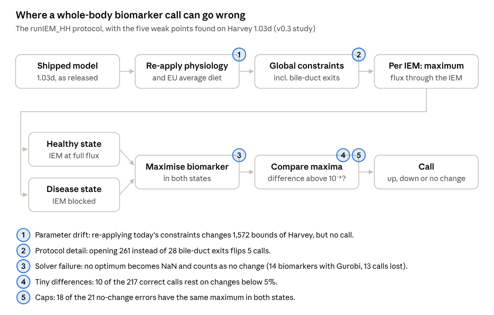
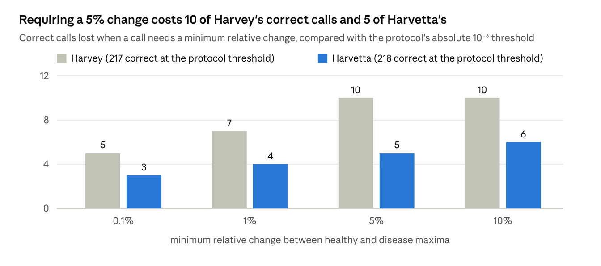

# Paper 2 draft: open whole-body IEM simulation and the robustness of its predictions

> Exported on 6 October 2026 from the Claude Doc "Paper 2 draft" (https://claude.ai/code/artifact/11c54dd2-869a-43a5-af19-9aed235e9eea), which is the working copy. Figures are screenshots of the doc's drawn figures.

Oct 5, 2026 · @Tim Hulshof

## Note for Tim

All results are in. Harvey comes from the v0.3 study. Harvetta and the flux-range analysis come from the v0.4 study, frozen on 5 October at 13:39 UTC before any of its results existed; every run finished on 6 October. The numbers here are in the two results notes in the repository (`docs/studies/wbm-iem-v0.3-results.md`, `wbm-iem-v0.4-results.md`) and are being checked by an independent agent.

Decisions that are yours:

- [ ] Framing towards the lab. The paper shows that `runIEM_HH`'s own score depends on solver failures and that the shipped Harvey carries older parameters. These points are best raised with the Toolbox's maintainers before submission, and a maintainer may want to be a co-author.
- [ ] Target journal (for example Bioinformatics, PLOS Computational Biology or Molecular Systems Biology).
- [ ] Authors, and the statement of how AI was used.

## Title and abstract

Title options:

1. Whole-body models of inborn errors of metabolism in Python: exact agreement with the COBRA Toolbox, and where the predictions are fragile
2. An open, MATLAB-validated implementation of whole-body biomarker prediction for inborn errors of metabolism
3. How robust are whole-body model predictions of biomarkers in inborn errors of metabolism?

**Motivation.** The whole-body models Harvey and Harvetta predict the direction in which biofluid biomarkers change in 57 inborn errors of metabolism, and agree with the literature for about 85% of them. The protocol runs only in MATLAB with a commercial solver, and the robustness of its predictions has not been examined.

**Results.** We ported the protocol and its physiological and diet setup to Python with the open solver HiGHS. The port sets every reaction bound exactly as the COBRA Toolbox does (81,094 in Harvey, 83,521 in Harvetta) and makes the same call wherever MATLAB returns an optimum. It gets 217 and 218 of 251 directions right (86.5%, 86.9%). The Toolbox's own figures are lower (81.0%, 75.8%) because Gurobi returned no optimum for 14 and 30 biomarkers, which the protocol scores as "no change". Some predictions are fragile: one protocol detail flipped five calls resting on differences below 0.5%, and requiring a 5% change removes 10 and 5 correct calls. Most "no change" errors (18 of 21; 16 of 18) are values held at a physiological cap, which a comparison of maxima cannot see. Comparing flux ranges, tested under a plan fixed before the runs, recovered none of them and cost 10 and 13 correct calls, because the protocol's healthy state forces maximal flux through the affected pathway.

**Conclusions.** The whole-body IEM protocol can now be run and checked without MATLAB. Its accuracy should be reported together with how solver failures and capped values are counted. Reporting capped values as indeterminate (post hoc) leaves 93.1% and 92.8% of the remaining calls correct.

**Availability.** Code, protocol files, study plans and all results: github.com/Unsaif/metabolic\_modelling\_advancements.

## Introduction

Whole-body metabolic models can predict which blood and urine metabolites change in inherited metabolic diseases. Using those predictions in diagnosis needs two things: an implementation anyone can run and check, and an honest account of how robust the predictions are.

The whole-body models Harvey and Harvetta combine organ-resolved human metabolism with physiological constraints: blood flow, kidney filtration and a defined diet \[1\]. Thiele et al. used them to simulate 57 inborn errors of metabolism (IEMs) and compared the predicted change of 252 known biofluid biomarkers with the literature. The direction was right for 85.3% of biomarkers in Harvey and 84.9% in Harvetta, against 50.2% for the generic reconstruction Recon3D \[1\].

That protocol, `runIEM_HH`, runs in the COBRA Toolbox for MATLAB \[2\]. Using it requires a MATLAB licence, and in practice a commercial solver. The Python ecosystem built around COBRApy \[3\] has no whole-body equivalent. An open implementation is only useful if it demonstrably does the same thing as the original, ideally bit for bit.

For clinical use, robustness matters as much as accuracy. A prediction should not depend on whether a solver happened to return an answer, on parameter values that changed between software versions, or on differences too small to mean anything biologically. An earlier biomarker-prediction method illustrates the risk: its recall fell to 0.10 when it moved from a curated test set to a clinical database \[5\].

Here we ported the protocol and its physiological and diet setup to Python with an open solver (HiGHS \[4\]). We checked the port against the COBRA Toolbox bound by bound and call by call. We then asked how robust the predictions are:

- to solver failures;
- to parameter drift between software versions;
- to small protocol details;
- to tiny healthy–disease differences;
- to saturation at physiological caps.

We repeated the analysis on Harvetta under a plan fixed before any Harvetta result existed. There we also tested comparing flux ranges, rather than maxima alone, as a remedy for saturation.

## Results

*Figure 1. How the protocol turns a model into a biomarker call, and the five places where the call proved fragile on Harvey. Each is examined below.*

### The port reproduces the Toolbox's model setup exactly

The Python port sets every lower and upper bound exactly as the COBRA Toolbox does: identical for all 81,094 reactions of Harvey and all 83,521 of Harvetta.

**What is ported.** `runIEM_HH` loads a whole-body model and re-applies the physiological constraints and the EU average diet, using the Toolbox's default physiological parameters. It then sets a few global constraints (reactions made irreversible or closed, and bile-duct exits opened) before simulating any disease. The port implements these steps from the Toolbox source at commit 67c790d, with the input tables extracted from the same commit: HMDB metabolite concentrations, blood-flow fractions and organ weights.

**How it was checked.** We ran the Toolbox's own setup in MATLAB R2024b with Gurobi 12 and compared the resulting bounds with the port's, bit for bit, both after the setup and after the global constraints. On both models they are identical. For Harvey the hash of MATLAB's final bounds also equals the one the Python run recorded. Before any MATLAB check, an independent re-implementation written from the Toolbox files had matched the port on both models.

**The shipped models carry older parameters.** Harvey 1.03d and Harvetta 1.03d are released with these constraints already applied, but with two older parameter values:

- a glomerular filtration rate computed as 20% of renal plasma flow (129.75 ml/min in Harvey, 128.64 in Harvetta) instead of 90 ml/min;
- cerebrospinal-fluid (CSF) export derived from 0.35 instead of 0.52 ml/min.

With those two values the port reproduces every stored bound of both models except three blood–brain-barrier uptakes. The current code therefore changes the released models when `runIEM_HH` re-applies it:

| Bounds changed by re-applying the current code | Harvey | Harvetta |
| --- | --- | --- |
| Kidney filtration (scaled by 0.694 in Harvey, 0.700 in Harvetta) | 1,011 | 1,010 |
| CSF export (scaled by 1.486) | 517 | 508 |
| Blood–brain-barrier uptakes | 3 | 3 |
| Diet: 31 AGORA-essential uptakes opened, 5 bile acids added (both bounds) | 41 | 41 |
| Total lower / upper bounds changed | 1,001 / 571 | 1,000 / 562 |

On Harvey these changes alter values but no call (below).

### Same calls as MATLAB wherever MATLAB returns an answer

Wherever the MATLAB run returned an optimum, the two implementations make the same direction call for every biomarker. The headline accuracies differ only because the Toolbox scores solver failures as "no change".

**Harvey.**

- **Calls.** Python and MATLAB agree on 238 of 251 biomarkers.
- **The 13 differences.** Every one is a biomarker whose healthy optimum MATLAB recorded as NaN: Gurobi did not report an optimal solution, so the Toolbox wrote no value. `runIEM_HH` compares the printed values, and a comparison with NaN is false, so it calls each of these "unchanged".
- **Python on those 13.** HiGHS solved all 13 problems and made the expected call every time. The solutions were certified against the LP the solver held: row and bound violations at most 2 × 10⁻⁷. An independent agent rebuilt each LP from the model file and MATLAB's own bounds and obtained the same optima within 2.6 × 10⁻⁵.
- **Values.** Above 10⁻³, the two implementations agree within 0.03% for all but one value, which differs by 0.3% (blood cholesterol in FED, healthy).
- **The figures.** By `runIEM_HH`'s own formula, which divides by all 252 biomarkers, MATLAB scores 204 of 252 (81.0%). On the 237 biomarkers where MATLAB returned values, both implementations get the same 204 right (86.1%).

| IEM | Biomarkers with no MATLAB optimum (healthy state) |
| --- | --- |
| ASNSD | asparagine, blood and CSF |
| BTD | acetoacetate, acetone, 3-hydroxybutyrate, urinary ammonium |
| EF | urinary fructose |
| GMT | urinary urate |
| PHOX1 | urinary oxalate, glycolate, glyoxylate |
| SUCLA | lactate, pyruvate |

A 14th biomarker, urinary 3-hydroxypropionate in BTD, also has no MATLAB optimum; both implementations call it unchanged. We did not diagnose why Gurobi returned no optimum for these problems. The point is that the protocol's accuracy depends on solver behaviour as well as on the model: the same model and code give 81.0% or 86.1%, depending on how failures are counted.

**Harvetta (plan fixed before the run).**

- **Calls.** Python and MATLAB agree on all 221 biomarkers for which MATLAB returned values.
- **Failures.** Gurobi returned no healthy optimum for 30 biomarkers, against 14 on Harvey; one more is absent from both models. HiGHS solved all 30, and Python calls 27 of them correctly. The three it gets wrong are blood folate in LNS and blood glucose in PC, also wrong on Harvey where MATLAB agrees, and urinary 3-hydroxypropionate in BTD, a threshold case (below).
- **Values.** Above 10⁻³, all 291 pairs of values agree within 0.008%.
- **The figures.** By `runIEM_HH`'s formula, MATLAB scores 191 of 252 (75.8%). On the 221 biomarkers where it returned values it gets 191 right (86.4%).

| IEM | Harvetta biomarkers with no MATLAB optimum |
| --- | --- |
| PC | 9 |
| BTD | 6 |
| HPII | 5 |
| LNS | 3 |
| CIT1, XAN1 | 2 each |
| ADSL, ASNSD, DGK | 1 each |

So the 85% headline can read 76%, 81% or 86–87% for the same models and the same protocol. Which one you get depends on the solver and on how its failures are counted.

### Accuracy, and what moves it

Run the way the Toolbox runs it today, the Python protocol gets 217 of 251 scored biomarker directions right in Harvey (86.5%) and 218 in Harvetta (86.9%). The published figures are 85.3% and 84.9%, from other model and code versions.

| Run | Model bounds | Bile-duct step | Correct / scored | Errors: opposite / no change | IEMs fully correct |
| --- | --- | --- | --- | --- | --- |
| Harvey v0.2 | as shipped | all 261 exits (a deviation) | 220 / 251 (87.6%) | 13 / 18 | 37 |
| Harvey v0.2b | as shipped | Toolbox list of 28 | 217 / 251 (86.5%) | 13 / 21 | 38 |
| **Harvey v0.3** | current Toolbox constraints re-applied | Toolbox list of 28 | **217 / 251 (86.5%)** | 13 / 21 | 38 |
| **Harvetta v0.4** | current Toolbox constraints re-applied | Toolbox list of 28 | **218 / 251 (86.9%)** | 15 / 18 | 35 |

"Scored" means an expected direction and both optima available. The one unscored biomarker (`EX_25aics[u]` in HPC) is absent from the model.

**A small protocol detail flips calls.** Our first Python run (v0.2) opened all 261 bile-duct exits where `runIEM_HH` opens a list of 28. Correcting that changed 5 calls, with a net loss of 3, and every one of them rested on a difference below 0.5%:

| IEM | Biomarker | v0.2 healthy → disease | v0.2b | Expected | Effect |
| --- | --- | --- | --- | --- | --- |
| DPYR | urinary uracil and 5,6-dihydrouracil | 120.28 → 120.85 (increased) | equal (unchanged) | increased | right → wrong |
| HCYS | blood homocystine and homocysteine | 28.18 → 28.27; 56.37 → 56.53 (increased) | equal (unchanged) | increased | right → wrong |
| HYPRO1 | urinary hydroxyproline | 28.22 = 28.22 (unchanged) | 0 → 28.22 (increased) | increased | wrong → right |

**Parameter drift changes values, not calls.** Re-applying the current constraints (v0.2b → v0.3, the 1,572 bound changes above) changed no call. Values did move: urinary maxima limited by kidney filtration, for example, scale by 0.69.

**Harvetta.** The protocol was run on Harvetta only as v0.4, with the current constraints and the Toolbox's bile-duct list. The two models share 12 of their opposite-direction errors and 12 of their no-change errors.

### Fragile calls and capped values

Some correct calls rest on very small differences, and most "no change" errors are values stuck at a physiological cap.

**Small differences.** The protocol calls a change when the disease maximum differs from the healthy maximum by more than 10⁻⁶ in absolute terms. Requiring a minimum relative change τ instead removes some correct calls:

*Figure 2. Correct calls lost at each minimum relative change, compared with the protocol's absolute 10⁻⁶ threshold (Harvey v0.3 and Harvetta v0.4 results files, 251 scored biomarkers each).*

In Harvey, five correct calls rest on changes below 0.1%. The smallest is coproporphyrin III in HPC, with a relative change of 10⁻⁷. In Harvetta, five correct calls rest on changes below 5%: blood glutamine in GACR (2.5 × 10⁻⁵), coproporphyrin III in CSF and blood in HPC, blood 3-hydroxypropionate in MMA and urinary glutamate in GACR. The threshold also cuts the other way. In Harvetta, a healthy maximum of 1.85 × 10⁻⁶ for urinary 3-hydroxypropionate in BTD sits just above the protocol's zero threshold, so the call reads "decreased" and counts as an opposite-direction error. In Harvey both values were zero. The analysis was post hoc for Harvey and declared before the run for Harvetta.

**Opposite direction (13 errors in Harvey, 15 in Harvetta, 12 of them shared).** Several are known physiology that the model does not reproduce:

| IEM(s) | Biomarker | Model | Expected | Wrong in |
| --- | --- | --- | --- | --- |
| CPS1, NAGS, OTC | blood citrulline | rises | falls | both |
| AADC | urinary L-DOPA and 3-methoxytyrosine | fall to zero | rise | both |
| PC | blood glucose | rises | falls | both |
| GMT | blood creatinine | falls to zero | rises | both |
| FED | blood cholesterol | rises | falls | both |
| OXOP | blood 5-oxoproline | rises | falls | both |
| LNS | blood folate | rises | falls | both |
| NAGS | urinary orotate | rises | falls | both |
| HCYS | blood ornithine | falls slightly | rises | both |
| MMA | blood 3-hydroxypropionate | falls slightly | rises | Harvey |
| MMA | blood carnitine | rises | falls | Harvetta |
| ASNSD | blood asparagine | rises | falls | Harvetta |
| BTD | urinary 3-hydroxypropionate | falls to zero | rises | Harvetta |

Two of the three errors only Harvetta makes sit at an edge. Blood carnitine in MMA was at its cap in both states on Harvey, a no-change error. In Harvetta's healthy state it stays below the cap (32.8 against 50 mmol/day), so the call becomes "increased". Urinary 3-hydroxypropionate in BTD is the threshold case above. The third reflects a real difference between the models: blood asparagine in ASNSD has a healthy maximum of 131 mmol/day in Harvey but zero in Harvetta, in MATLAB as well as in Python. In the other direction, blood 3-hydroxypropionate in MMA is right in Harvetta, on a change of 0.3%.

**No change predicted (21 errors in Harvey, 18 in Harvetta, 12 of them shared).** In 18 of Harvey's and 16 of Harvetta's, the healthy and disease maxima are equal and positive. Each such value sits at a cap set by the constraints, for example:

- the urinary filtration limit for a metabolite without a measured blood range (20 µM × the filtration rate = 2.592 mmol/day);
- a measured filtration or excretion limit (uracil, 84.11 mmol/day);
- most likely the carnitine supply in the diet (methylmalonic acidemia acylcarnitines at 50 mmol/day, the carnitine uptake limit).

The protocol maximises each biomarker, so once both states reach the cap it cannot see a difference. The remaining errors are zero in both states: aldosterone and cortisol in CYP21D on both models, and urinary 3-hydroxypropionate in BTD on Harvey. Which values hit a cap depends on the model: 10 of Harvetta's 16 capped errors are also capped errors in Harvey.

**Reporting caps as indeterminate (post hoc).** A maximum-only comparison cannot call a biomarker whose two maxima are equal and positive. Reporting such cases as "indeterminate" rather than "no change" would remove only errors: 217 of the remaining 233 calls are right in Harvey (93.1%), and 218 of 235 in Harvetta (92.8%). This changes what is reported, not what the model predicts.

### Flux ranges do not fix the capped values

Comparing minima as well as maxima recovered none of the capped calls on either model, and the full-range rule lost 10 correct calls on Harvey and 13 on Harvetta. Both rules were fixed in code before any minimum was computed (Methods).

| Rule (251 biomarkers per model with all four optima) | Correct, Harvey | Correct, Harvetta | Errors fixed | Correct calls lost |
| --- | --- | --- | --- | --- |
| Maxima only (the protocol) | 217 | 218 | — | — |
| R1, full range | 207 (−10) | 205 (−13) | 0 | 10 and 13 |
| R2, tie-break on equal maxima | 217 (0) | 218 (0) | 0 | 0 |

**Why the minima do not help.**

- **The capped biomarkers.** Their minimum is zero in both states in 17 of 18 cases in Harvey and 13 of 16 in Harvetta. The model can always send the metabolite elsewhere, so a blocked pathway forces nothing into urine or blood.
- **The full-range rule's losses.** All of them (10 in Harvey, 13 in Harvetta) are "conflicting" calls: the disease maximum rises while the disease minimum falls to zero.

The second point follows from how the protocol defines health. The healthy state forces maximal flux through the IEM's reactions, which forces some downstream metabolites to be made and excreted (healthy minimum above zero). The disease state blocks those reactions and forces nothing (minimum zero). So the healthy reference is an extreme state, not a typical one, and the flux-range logic of Shlomi et al. \[5\] does not carry over to it.

**Readings.** By the rules declared before the runs, R1 is harmful: it lost correct calls on both models and fixed none. R2 is not useful: it fixed no error on either model. In one capped case on Harvey and three on Harvetta, the healthy minimum is above zero and the disease minimum is zero, so the tie-break turns a "no change" error into a "decreased" one.

## Discussion

An open implementation now reproduces the whole-body IEM protocol exactly, and the reproduction shows that its headline accuracy depends on choices outside the model. Bounds match the COBRA Toolbox on both models, and calls match wherever MATLAB returns an optimum. The 57-disease benchmark can therefore be rerun and checked without a MATLAB or Gurobi licence.

**Accuracy belongs to the whole pipeline.** The same models and protocol give 75.8% to 86.9%, depending on the solver and on how its failures are counted. The published 85.3% and 84.9% come from other model and code versions \[1\]. We suggest reporting accuracy among scored biomarkers together with coverage, and treating a failed solve as unscored rather than as "no change".

**Parameter drift changed values, not calls.** The released models carry an older filtration rate and CSF export, so re-applying the current code changes over 1,500 bounds in each model. On Harvey this moved values, for example urinary maxima by a factor of 0.69, but no call. Any use of magnitudes will be sensitive to it, so the constraint version should be stated with every result.

**Calls need effect sizes.** Some correct calls rest on changes below 0.1%, and a healthy value just above the zero threshold turned one call into an error. A relative threshold of 5% costs 10 correct calls in Harvey and 5 in Harvetta. Reporting the relative change with each call would let users judge how far a call can be trusted.

**Caps cause most "no change" errors, and flux ranges do not fix them.** Flux-range comparison \[5\] did not carry over because the protocol's healthy state forces maximal flux through the affected reactions; its minima reflect that choice rather than physiology. Three other remedies are open, each to be planned and tested before use:

- reporting capped values as indeterminate (post hoc: 93.1% and 92.8% of the remaining calls correct);
- defining a typical rather than maximal healthy state;
- relaxing the biomarker's own binding cap.

**Limitations.**

- The study is not blind: the disease labels and the published figures were known throughout.
- Harvetta shares its structure, labels, diet and constraints with Harvey. Its results are a replication on a closely related model, not an independent validation.
- MATLAB was run once per model, with one solver version and the protocol's own settings. We did not try to reduce Gurobi's failures.
- Calls are directions scored against the protocol's literature labels. We did not re-curate those labels or test magnitudes.

**Next steps.** The open pipeline makes the next tests possible without a licence: predicted changes against measured patient profiles, magnitudes rather than directions, and pre-registered remedies for the caps.

## Methods

**Models.** Harvey 1.03d and Harvetta 1.03d from the COBRA Toolbox's model repository (opencobra/COBRA.models, commit 75c070d). Each is loaded with its coupling constraints, which COBRApy's reader drops, and solved as one linear program: 81,094 reactions in Harvey and 83,521 in Harvetta.

**Model setup (port).** `gembench/wbm_constraints.py` reimplements the setup at the top of `runIEM_HH.m` (COBRA Toolbox commit 67c790d):

- `standardPhysiolDefaultParameters` for the model's sex;
- `physiologicalConstraintsHMDBbased`: blood uptake via plasma flow, kidney filtration via the filtration rate, CSF export, urinary excretion via creatinine, and literature constraints;
- `EUAverageDietNew` with `setDietConstraints`.

Its input tables are extracted from the same commit. Where the MATLAB code takes the first of several matching entries, the port does too.

**IEM protocol.** The 57 IEMs and 252 biomarkers of `runIEM_HH.m` were parsed into a machine-readable protocol. The scoring logic follows `checkIEM_WBM`:

- **Healthy and disease states.** The maximum summed flux through the IEM's reactions is computed and truncated to six decimals. The healthy state must reach it; the disease state blocks those reactions.
- **Biomarker optima.** Each biomarker's maximum flux is computed in both states, with demand reactions added for blood biomarkers.
- **Calls.** A biomarker is called increased or decreased when the disease maximum exceeds or falls below the healthy maximum by more than 10⁻⁶, after values of at most 10⁻⁶ in magnitude are set to zero.
- **Isolation.** Each IEM starts from the same global state.

**Solver.** HiGHS 1.15.1 \[4\], interior point with crossover, primal and dual tolerances 10⁻⁷, at most 1,800 s per solve. A solve that does not end optimal gives no call, and the biomarker is reported as unscored rather than "unchanged".

**Scoring.** Accuracy is the number of correct calls among scored biomarkers, i.e. those with an expected direction and both optima available, reported with coverage. `runIEM_HH`'s own figure, (correct increases + correct decreases) / all biomarkers, is reported alongside.

**MATLAB reference.** `runIEM_HH.m` was run unchanged in MATLAB R2024b with the COBRA Toolbox at commit 67c790d and Gurobi 12, except for two edits: the model was loaded from the 1.03d file instead of the newest version on the path, and a stray `edit` command was removed. The jobs ran through a local job queue; their scripts and outputs are in the repository. Python and MATLAB bounds were compared bit for bit, and calls were compared on MATLAB's printed values, as `runIEM_HH` compares them.

**Effect sizes.** For a relative threshold τ, a change is called when (disease − healthy) / max(|healthy|, |disease|) exceeds τ in absolute value, on the biomarkers scored by the protocol.

**Flux ranges.** For the v0.4 study the minimum biomarker flux was also computed in each state, with the same setup and solver. Two rules, fixed in code before any minimum existed on either model, compare the healthy and disease ranges. Each uses the protocol's tolerance of 10⁻⁶:

- **R1, full range** (in the spirit of Shlomi et al. \[5\]): increased if the minimum or the maximum rises and neither falls; decreased if one falls and neither rises; unchanged if both are equal; conflicting, counted as wrong, if one rises and the other falls.
- **R2, tie-break:** keep the protocol call unless it is "unchanged", and then call from the minima alone.

They are scored on directional biomarkers whose four optima are all optimal and finite.

**Study plans and verification.** Each study was frozen before its runs: a manifest of file hashes committed to git and recorded in a private project document. v0.3 was frozen on 4 October 2026 and v0.4 on 5 October at 13:39 UTC. An independent agent with its own code recomputed every reported number from the result files.

## Data and code availability

All code, protocol files, freeze manifests, Python results and MATLAB outputs are in the project repository (github.com/Unsaif/metabolic\_modelling\_advancements, branch `claude/opus-continuation`). It should be archived with a DOI before submission.

| What | Where in the repository |
| --- | --- |
| Port and protocol engine | `gembench/wbm_constraints.py`, `gembench/wbm_iem.py`, `scripts/run_wbm_iem.py` |
| Constraint inputs and IEM protocol | `data/iem/wbm_constraint_inputs_v0.3.json`, `data/iem/iem_protocol_v0.2.json` |
| Study plans and freezes | `docs/studies/wbm-iem-v0.3-plan.md`, `wbm-iem-v0.4-plan.md`; `results/study_freezes/wbm_iem_v0.3_plan.json`, `wbm_iem_v0.4_plan.json` |
| Python results | `results/wbm_iem/Harvey_1_03d_iem_results_v0.3.json` and the v0.4 files |
| MATLAB jobs and outputs | `tools/matlab/runner/`, `results/wbm_iem/matlab_reference/` |
| Comparisons and analyses | `scripts/compare_matlab_reference.py`, `iem_effect_size_sensitivity.py`, `iem_range_calls.py`, `certify_iem_solutions.py` |
| Independent verification | `results/wbm_iem/independent_verification_v0.3/REPORT.md` |

## References

Draft list; to be checked against publisher records.

1. Thiele I, et al. Personalized whole-body models integrate metabolism, physiology, and the gut microbiome. *Mol Syst Biol.* 2020;16:e8982.
2. Heirendt L, et al. Creation and analysis of biochemical constraint-based models using the COBRA Toolbox v.3.0. *Nat Protoc.* 2019;14:639–702.
3. Ebrahim A, Lerman JA, Palsson BO, Hyduke DR. COBRApy: COnstraints-Based Reconstruction and Analysis for Python. *BMC Syst Biol.* 2013;7:74.
4. Huangfu Q, Hall JAJ. Parallelizing the dual revised simplex method. *Math Program Comput.* 2018;10:119–142.
5. Shlomi T, Cabili MN, Ruppin E. Predicting metabolic biomarkers of human inborn errors of metabolism. *Mol Syst Biol.* 2009;5:263.
