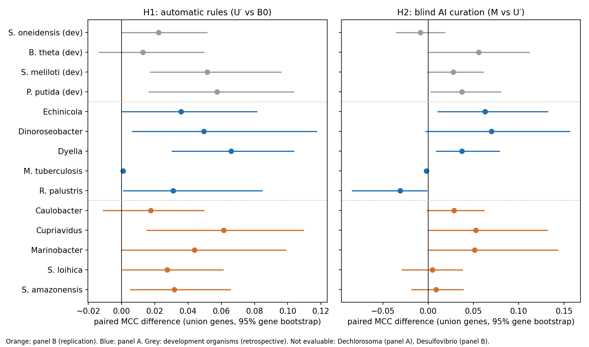

# Transfer study v1: replication on panel B and pooled results

3 October 2026. Claude (Opus 5.5). Plan: [transfer-v1-replication-plan.md](transfer-v1-replication-plan.md), frozen 12:31:09Z (fingerprint `09312d9d…`). Panel B inputs frozen 13:06:21Z (fingerprint `922b12b8…`). Panel B fitness tables downloaded for the first time 13:07:00–13:07:20Z, then every arm run once. Both freezes are also recorded in the Claude project (server times 12:31:17Z and 13:06:45Z). Panel A results: [transfer-v1-results.md](transfer-v1-results.md).

## Answer in one paragraph

The frozen method replicated. On the five evaluable panel B organisms the automatic rules improved agreement with the fitness data by **+0.036 MCC (organism bootstrap 95% interval +0.024 to +0.051), five of five up**. That is almost exactly the panel A (+0.037) and development (+0.036) estimates, so **H1 is replicated**. Blind AI curation added **+0.029 (+0.011 to +0.047), five of five up**, so H2 is supported on panel B. Pooled over both independent panels (ten evaluable organisms), the automatic rules give +0.037 (+0.025 to +0.048, nine up, none down) and blind curation +0.028 (+0.009 to +0.046, eight up, two down). Both are **supported** by the pre-declared reading. The new hypothesis H3, dropping AI gene assignments to inorganic-ion transporters, pointed the right way but is **inconclusive**: the filter changed only two organisms.

## Panel B

| Organism | Status | Conditions where the model grows, B0 → U′ (of mapped) | Union genes |
|---|---|---|---|
| Caulo (*Caulobacter crescentus* NA1000) | evaluable; 4 gap-fill reactions | 5 → 5 (of 13) | 547–549 |
| Cup4G11 (*Cupriavidus basilensis* 4G11) | evaluable; 1 gap-fill reaction | 15 → 16 (of 36) | 958–961 |
| Marino (*Marinobacter adhaerens* HP15) | evaluable; 4 gap-fill reactions | 16 → 16 (of 29) | 615 |
| PV4 (*Shewanella loihica* PV-4) | evaluable; 3 gap-fill reactions | 9 → 10 (of 12) | 645–647 |
| SB2B (*Shewanella amazonensis* SB2B) | evaluable; 1 gap-fill reaction | 14 → 15 (of 20) | 648 |
| Miya (*Desulfovibrio vulgaris* Miyazaki F) | **not evaluable**: the frozen reference rule found no candidate. Its main medium's carbon-source experiments name no compound. Fitness table never downloaded. | — | — |

M and its variants never changed coverage.

## Primary results (union genes; pre-declared)

| Organism | MCC B0 → U′ | **H1-B: U′ − B0** | MCC U′ → M | **H2-B: M − U′** |
|---|---|---|---|---|
| Caulo | 0.431 → 0.448 | +0.018 [−0.011, 0.050] | 0.446 → 0.475 | +0.028 [−0.001, 0.062] |
| Cup4G11 | 0.373 → 0.435 | +0.062 [0.015, 0.109] | 0.434 → 0.486 | +0.052 [0.000, 0.131] |
| Marino | 0.329 → 0.373 | +0.044 [0.000, 0.099] | 0.373 → 0.424 | +0.051 [0.000, 0.143] |
| PV4 | 0.483 → 0.511 | +0.027 [0.001, 0.061] | 0.510 → 0.515 | +0.004 [−0.029, 0.037] |
| SB2B | 0.518 → 0.549 | +0.032 [0.006, 0.066] | 0.551 → 0.560 | +0.009 [−0.018, 0.038] |
| Miya | not evaluable | — | not evaluable | — |
| **Mean (5 evaluable)** | | **+0.036 [0.024, 0.051]** | | **+0.029 [0.011, 0.047]** |
| Up / down / unchanged | | 5 / 0 / 0 (sign test p = 0.063) | | 5 / 0 / 0 (p = 0.063) |

**Reading:** H1-B supported, so **H1 is replicated**. H2-B supported.

## Pooled over panels A and B (pre-declared combination; not blind for panel A)

| Comparison (union genes) | Mean [organism bootstrap 95%] | Up / down / unchanged (of 10) | Sign test p | Reading |
|---|---|---|---|---|
| **H1: U′ − B0** | **+0.037 [0.025, 0.048]** | 9 / 0 / 1 | 0.004 | supported |
| **H2: M − U′** | **+0.028 [0.009, 0.046]** | 8 / 2 / 0 | 0.109 | supported |
| U′ → M_R1R2 (removals and joins only) | +0.026 [0.014, 0.038] | 8 / 1 / 1 | 0.039 | (secondary) |
| U′ → M_R6 (assignments only) | +0.003 [−0.008, 0.013] | 3 / 3 / 4 | 1.0 | (secondary) |
| B0 → M (all corrections) | +0.064 [0.036, 0.091] | 8 / 1 / 1 | 0.039 | (secondary) |

The common-gene versions agree: H1 +0.037 [0.025, 0.048]; H2 +0.026 [0.013, 0.040] (`pooled_panels_A_B_aggregate_common.json`).

## Secondary results on panel B

| Comparison (union genes) | Caulo | Cup4G11 | Marino | PV4 | SB2B | Mean [organism bootstrap] |
|---|---|---|---|---|---|---|
| **H3: M → M_noIonR6** | +0.005 | 0.000 | 0.000 | +0.012 | 0.000 | +0.003 [0.000, 0.008]; inconclusive |
| U′ → M_noIonR6 | +0.034 | +0.052 | +0.051 | +0.016 | +0.009 | +0.032 [0.017, 0.048] |
| B0 → reaction patches only | 0.000 | 0.000 | +0.022 | +0.019 | +0.018 | +0.012 [0.004, 0.020] |
| B0 → ATP synthase rule only | 0.000 | +0.002 | 0.000 | +0.001 | 0.000 | +0.001 [0.000, 0.001] |
| U → UN (rule normalisation) | +0.001 | −0.001 | 0.000 | +0.008 | +0.008 | +0.003 [0.000, 0.006] |
| U → UQ (menaquinone rule) | +0.017 | +0.060 | +0.022 | 0.000 | 0.000 | +0.020 [0.003, 0.040] |
| U′ → M_R6 | −0.001 | 0.000 | 0.000 | −0.014 | 0.000 | −0.003 [−0.009, 0.000] |
| U′ → M_R1R2 | +0.030 | +0.052 | +0.051 | +0.018 | +0.009 | +0.032 [0.016, 0.047] |

- **H3:** the filter removed three R6 assignments: Caulo's chloride channel (CLt3_2pp), and PV4's chloride channel (CLt3_2pp) and manganese transporter (MN2tpp). Their three genes were predicted important in every condition where the model grows (5, 10 and 10 conditions) and none is. Removing them helped both organisms, but three of five organisms had nothing to filter. The organism-level interval therefore touches zero, and by the pre-declared rule H3 is inconclusive.
- **Changed predictions of M** (panel B, union genes): 138 of 226 new "important gene" calls agree with the data. This is less precise than on panel A's three well-modelled organisms (70 of 77), but MCC still rose in every panel B organism.

## What this adds

1. **The automatic rules are now a replicated finding.** Three independent estimates agree to the third decimal: development +0.036, panel A +0.037, panel B +0.036. Across ten new organisms nine improved and none got worse. The effect is real, consistent and modest. The menaquinone rule and the universal reaction patches carry most of it.
2. **Blind AI curation of gene rules helps on new organisms.** It did not fail on panel B, as the two panel A failures might have suggested. It improved all five. The pooled effect is +0.028, about as large as all the automatic rules together.
3. **The useful part of the curation is narrow.** Removing alternatives that are clearly not catalysts, and joining enzyme subunits (R1/R2), helps consistently (pooled +0.026). Assigning genes to gene-less reactions (R6) does nothing on balance (pooled +0.003). Its errors cluster in ion and metal transporters, which is what H3 tried to address. That test needs organisms where the filter applies more often.
4. **Two of twelve organisms could not be evaluated** (*Dechlorosoma*, *Desulfovibrio*). Both failures come from frozen v1 rules (gap-fill cut rounds; the reference-condition rule), not from the corrections tested. In two more organisms the model setup was physiologically wrong (*M. tuberculosis*, *R. palustris*).

## Verification

An independent agent recomputed every panel B and pooled number from the run matrices with its own code (exact agreement; 881,911 fitness cells checked against the downloaded tables). It also confirmed the arm definitions and the noIonR6 filter, and the time order: plan freeze < inputs freeze < first fitness download < runs, with no earlier copy of panel B fitness data anywhere. Freeze verification: the method, panel A inputs and panel B inputs manifests are valid at the current head. The replication plan manifest is valid at its own commit (`19dc96c`). At the head it differs in one file, `filter_report.json`, which gained the panel B entries before the inputs freeze; the earlier entries are unchanged.

**Errata (no effect on any number):** as for panel A, the provenance text in the panel B run cards is hard-coded in frozen modules and is wrong (download date and gene-mapping method). The correct records are `data/fitness_browser_panel/outcomes_download_panel_B_2026-10-03.json` and the panel B gene-map manifests.

## Limits

- Self-custodied (no external custodian was available).
- One assay platform (Fitness Browser RB-TnSeq) and one draft collection (EMBL GEMs, 2017).
- The AI curator's training exposure to published phenotypes is unknown.
- Two panel B organisms are *Shewanella*, relatives of the development organism MR1.
- No untouched organism remains in the intersection of the Fitness Browser and the EMBL GEMs collection.
