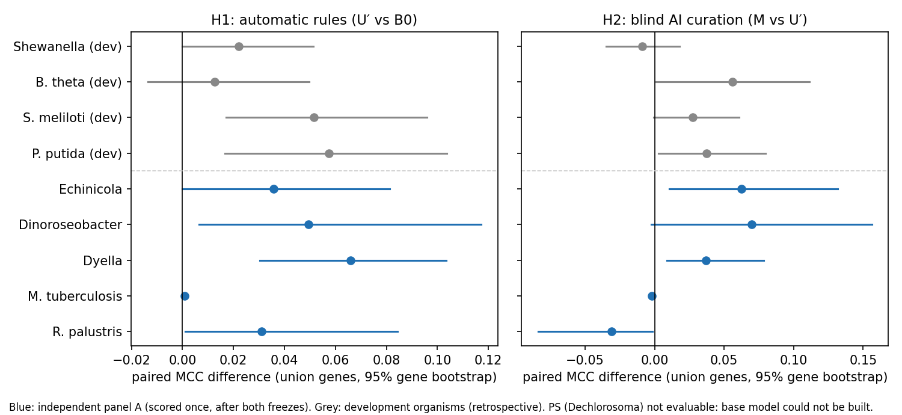

# Transfer study v1: results on the independent panel

3 October 2026. Claude (Opus 5.5). Method: [transfer-method-v1.md](transfer-method-v1.md) (frozen 09:40:45Z, fingerprint `7ffb4213…`); panel A inputs frozen 10:11:43Z (fingerprint `ddf371e2…`); panel A fitness tables downloaded for the first time 10:12:18–10:12:40Z; every arm run once afterwards. Both freezes are also recorded in the Claude project (server times 09:41:01Z and 10:11:50Z).

## Answer in one paragraph

The automatic, annotation-only correction rules (U′) transferred: on the five evaluable new organisms they improved agreement with the fitness data by **+0.037 MCC on average (organism bootstrap 95% interval +0.017 to +0.054)**, four organisms up and none down, almost exactly the development estimate (+0.036). By the pre-declared reading H1 is **supported**. Blind AI curation of gene rules (M) added **+0.027 on average (−0.007 to +0.060)**: clearly positive in the three organisms whose models behave sensibly (+0.04 to +0.07), slightly negative in *M. tuberculosis* and negative in *R. palustris*, the two organisms whose experiments the draft models cannot represent properly. By the pre-declared reading H2 is **inconclusive**.

## Panel

| Organism | Status | Conditions where the model grows (of mapped) | Union genes |
|---|---|---|---|
| Cola (*Echinicola vietnamensis*) | evaluable; no gap-fill needed | 7 of 14 | 497–500 |
| Dino (*Dinoroseobacter shibae*) | evaluable; 7 gap-fill reactions | 7 of 21 | 584–588 |
| Dyella79 (*Dyella japonica*) | evaluable; 3 gap-fill reactions | 6 of 9 | 542–544 |
| MycoTube (*M. tuberculosis* H37Rv) | evaluable; no gap-fill needed | 19 of 19 | 463 |
| RPal_CGA009 (*R. palustris*) | evaluable; 5 gap-fill reactions incl. a nitrate reductase | 3 of 7 | 679–683 |
| PS (*Dechlorosoma suillum*) | **not evaluable**: every gap-fill solution created an energy-generating cycle; fitness table never downloaded | — | — |

Coverage did not change between arms in any organism.

## Primary results (union genes; pre-declared)

| Organism | MCC B0 → U′ | **H1: U′ − B0** | MCC U′ → M | **H2: M − U′** |
|---|---|---|---|---|
| Cola | 0.440 → 0.476 | +0.036 [0.000, 0.081] | 0.470 → 0.533 | +0.063 [0.011, 0.132] |
| Dino | 0.422 → 0.472 | +0.049 [0.007, 0.117] | 0.460 → 0.530 | +0.070 [−0.003, 0.156] |
| Dyella79 | 0.502 → 0.568 | +0.066 [0.030, 0.104] | 0.560 → 0.597 | +0.037 [0.009, 0.078] |
| MycoTube | −0.016 → −0.016 | +0.001 [0.000, 0.002] | −0.016 → −0.018 | −0.002 [−0.004, −0.001] |
| RPal_CGA009 | 0.145 → 0.176 | +0.031 [0.001, 0.084] | 0.176 → 0.145 | −0.031 [−0.084, −0.002] |
| PS | not evaluable | — | not evaluable | — |
| **Mean (5 evaluable)** | | **+0.037 [0.017, 0.054]** | | **+0.027 [−0.007, 0.060]** |
| Up / down / unchanged | | 4 / 0 / 1 (sign test p = 0.125) | | 3 / 2 / 0 (p = 1.0) |

Per-organism intervals: 1,000-resample gene bootstrap. Mean intervals: 10,000-resample organism bootstrap. MCC values are on each comparison's own paired observations. Files: `results/transfer_v1/evaluation_panel_A/paired.json`, `aggregate_union.json`.

**Reading (section 5.3 of the method):** H1 supported (mean positive, interval excludes zero). H2 inconclusive (mean positive, interval includes zero).

## Secondary analyses (pre-declared)

| Comparison (union genes) | Cola | Dino | Dyella79 | MycoTube | RPal | Mean [organism bootstrap] |
|---|---|---|---|---|---|---|
| B0 → reaction patches only | 0.000 | +0.026 | 0.000 | 0.000 | 0.000 | +0.005 [0.000, 0.016] |
| B0 → ATP synthase rule only | +0.006 | +0.010 | 0.000 | +0.000 | 0.000 | +0.003 [0.000, 0.008] |
| U → UN (rule normalisation) | +0.019 | 0.000 | 0.000 | 0.000 | 0.000 | +0.004 [0.000, 0.011] |
| U → UQ (menaquinone rule) | 0.000 | +0.013 | +0.060 | 0.000 | +0.026 | +0.020 [0.003, 0.041] |
| U′ → M_R6 (assignments only) | +0.018 | +0.035 | +0.019 | 0.000 | −0.031 | +0.008 [−0.012, 0.025] |
| U′ → M_R1R2 (removals and joins only) | +0.046 | +0.037 | +0.019 | −0.002 | 0.000 | +0.020 [0.003, 0.037] |

- **Common genes** (secondary metric): H1 +0.037 [0.017, 0.054], identical; H2 +0.021 [−0.000, 0.042] (`aggregate_common.json`).
- **Without MycoTube** (sensitivity for the adjudicator's possible knowledge of published *M. tuberculosis* phenotypes): H2 +0.035 [−0.008, 0.066], still inconclusive (`aggregate_union_without_MycoTube.json`).
- **Changed predictions of M.** Genes present in both models: new "important" calls agreeing with the data in Cola 18 of 18, Dino 12 of 12, Dyella79 12 of 12, MycoTube 0 of 95, RPal 0 of 3. Genes that M adds to the model: Cola 7 of 7 (ketol-acid reductoisomerase), Dino 9 of 16 (dihydroorotate oxidase 7 of 7, rhamnose transporter 2 of 2, dihydropyrimidinase 0 of 7), Dyella79 12 of 12 (ArgB, ArgC), RPal 0 of 12 (zinc ABC transporter, glycine-cleavage H protein).

## What the numbers say, and what they do not

1. **The automatic rules are a real, transferable improvement, but a small one.** Every evaluable organism moved up or stayed level, by about the same amount as in development. The largest single contributor on the new organisms was the menaquinone rule (removing menaquinone from the biomass of organisms without a menaquinone pathway), not the reaction patches that dominated development. MCC values stay around 0.45–0.6 for the three well-behaved organisms: the corrected drafts are better, not good.
2. **Blind AI curation helps where the model is otherwise sensible.** In Cola, Dino and Dyella79, 70 of the 77 new "important gene" predictions it created were confirmed by the data; the 7 misses all come from one assignment in Dino (dihydropyrimidinase, a pyrimidine-degradation enzyme that the model runs backwards). Its two failures are in organisms where the model's physiology is wrong for reasons the curator could not see (next point). As in development, removals and joins (R1/R2) were the reliable part and gene assignments to gene-less reactions (R6) were mixed: in *R. palustris* the assignment of a zinc ABC transporter and of the glycine-cleavage H and T proteins made four genes "important" in every condition, and none is. That mirrors the copper transporter that cost MR1 in development.
3. **Two organisms show limits of the pipeline, not of the rules.** Both follow from frozen choices recorded before the outcomes were downloaded.
   - *M. tuberculosis*: the "no carbon" Sauton's recipe still contains asparagine, citrate (as ferric ammonium citrate) and 0.2% ethanol. Under the frozen media rule these are unlimited, so the model grows at an implausible 8–9 /h in every condition, and its predictions carry no signal (MCC ≈ 0 in every arm). Any differences there are noise around zero.
   - *R. palustris*: its experiments are phototrophic and anaerobic. The CarveMe universe has no photosystem, so the gap-fill made the model respire the trace nitrate of the medium's cobalt nitrate. The model grows in 3 of 7 conditions with a wrong energy metabolism (MCC 0.15–0.18).
4. **Six organisms is a small panel.** With five evaluable organisms the organism bootstrap has few distinct values and the sign test cannot reach significance unless all five move together. H1's interval excludes zero because the effects were consistent, not because the panel is large.

## Lessons for the next method version (to be tested on panel B, not on panel A)

Panel A has now been used. Changing anything because of these results is a new development iteration and needs the reserved panel B (Caulo, Cup4G11, Marino, Miya, PV4, SB2B) or new data. Candidate changes:
- Media rule: limit counter-ions supplied only by trace-element salts (ammonium of molybdate, nitrate of cobalt nitrate) to trace uptake; flag "no carbon" media that contain organic carbon (Sauton's).
- Phototrophs: either add a light-driven proton pump pseudo-reaction for organisms whose annotation contains a bacterial reaction centre, or exclude phototrophic experiments up front.
- Gap-fill: more energy-cycle cut rounds or a different objective, so organisms like PS can be built.
- Adjudication: no R6 assignments to transporters of metal ions (development MR1 copper, panel RPal zinc), and caution with catabolic enzymes that a model can run backwards (Dino dihydropyrimidinase); keep R1/R2.

## Verification

An independent subagent recomputed every primary and secondary number from the run matrices with its own code (exact agreement; 376,620 fitness cells checked against the downloaded tables), confirmed both freeze manifests are valid and unchanged, and confirmed the time order (method freeze → inputs freeze → first fitness download → runs) from git history, manifest timestamps, the download record and the project's server-side times.

**Erratum (no effect on any number):** the provenance text in the panel A run cards (`card.json`) is hard-coded in frozen modules and wrongly says the fitness data were downloaded on 5 September 2026 and mapped through GenPept locus tags. The correct records are `data/fitness_browser_panel/outcomes_download_2026-10-03.json` and `data/genpept_panel/` (sequence-based mapping).

## Limits
Self-custodied (same model family designed, prepared and evaluated; separation by recorded order, with external project timestamps); one platform (Fitness Browser RB-TnSeq) and one draft collection (EMBL GEMs, 2017); the curator's training exposure to published phenotypes is unknown; one organism failed before scoring.
